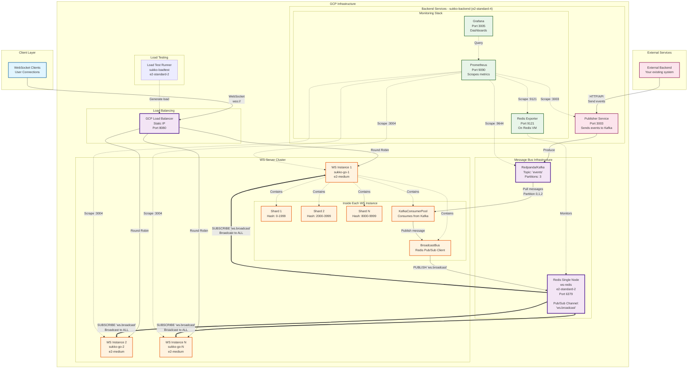
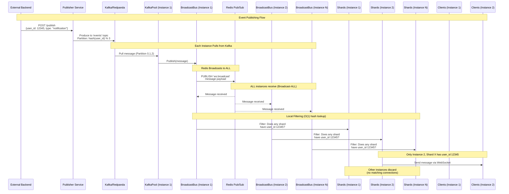
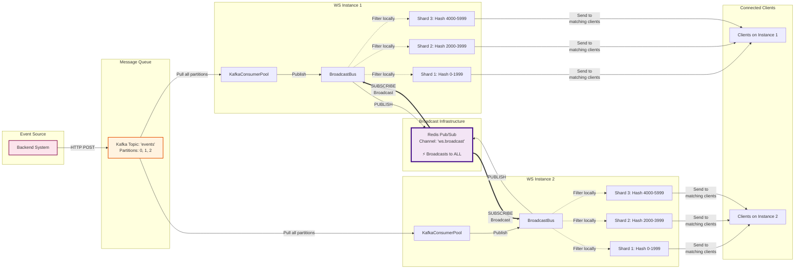
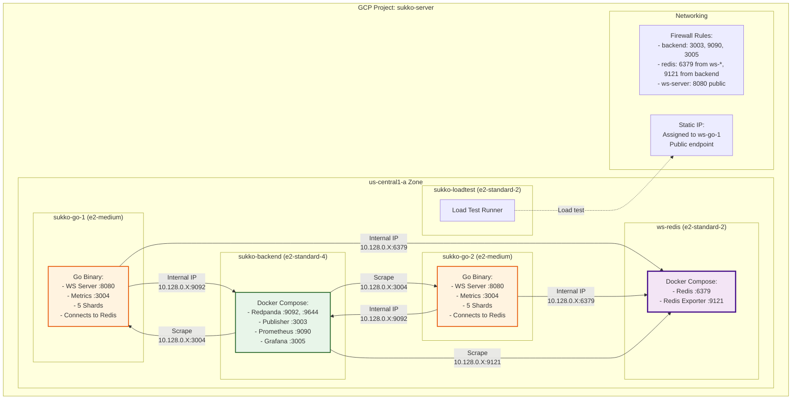

# WebSocket POC - Infrastructure Architecture

## High-Level System Diagram



## Message Flow Diagram



## Data Flow Architecture



## GCP VM Layout



---

## Key Architectural Points

### 1. **Broadcast-ALL Pattern**
- Redis does **NOT** do targeted dispatch or lookups
- Redis broadcasts to **ALL** WS instances via Pub/Sub
- Each instance filters locally using O(1) hash lookup
- Trade-off: Higher network bandwidth for simplicity and statelessness

### 2. **Horizontal Scaling**
- Multiple WS instances can be added without coordination
- Each instance has identical shard configuration (Hash 0-9999)
- Load balancer distributes incoming connections
- All instances share the same Redis and Kafka

### 3. **Shard-Based Connection Management**
- Each WS instance has N shards (default: 5)
- Shard assignment: `hash(user_id) % TOTAL_SHARDS`
- Each shard maintains a map of `user_id → WebSocket connections`
- Local filtering is O(1) hash lookup

### 4. **Message Delivery Guarantee**
- Kafka ensures at-least-once delivery
- Redis Pub/Sub provides best-effort broadcast
- Each instance independently processes Kafka messages
- No message loss during scaling (all instances receive all messages)

### 5. **Zero-Code-Change Deployment**
- Single node: `REDIS_SENTINEL_ADDRS=10.128.0.10:6379` (1 address)
- Sentinel cluster: `REDIS_SENTINEL_ADDRS=node1:26379,node2:26379,node3:26379` (3+ addresses)
- Code auto-detects mode and connects appropriately

---

## Monitoring & Observability

### Prometheus Metrics
- **WS Servers**: Active connections, messages sent, latency
- **Redis**: Connected clients, commands/sec, latency percentiles, memory usage
- **Kafka**: Lag, throughput, partition distribution
- **Publisher**: Event publishing rate, errors

### Grafana Dashboards
1. **WebSocket Overview**: Connections, message rates, shard distribution
2. **Redis BroadcastBus**: Health, performance, pub/sub channels
3. **Kafka Pipeline**: Consumer lag, partition balance, throughput

---

## Cost Analysis (Monthly)

| Component | Instance Type | Count | Cost/Month |
|-----------|--------------|-------|------------|
| Backend (Monitoring + Kafka) | e2-standard-4 | 1 | $105 |
| Redis (BroadcastBus) | e2-standard-2 | 1 | $53 |
| WS Server | e2-medium | 2-10 | $26-130 |
| Load Test | e2-standard-2 | 1 | $53 (dev only) |
| **Total (Production)** | | | **$184-288** |

*Costs assume us-central1 region, 730 hours/month*

---

## Deployment Commands

```bash
# Full deployment (creates all VMs, configures networking, deploys services)
task gcp:deploy

# Individual components
task gcp:redis:create-vm
task gcp:redis:deploy-single
task gcp:redis:health

# Monitoring
task gcp:status
task gcp:health:all
task gcp:stats:urls
```

---

## Next Steps

1. **Local Testing** (5-10 min): `docker-compose -f docker-compose.redis-local.yml up -d`
2. **GCP Deployment** (15-30 min): `task gcp:deploy`
3. **Multi-Instance Testing** (Week 2): Deploy 2+ WS instances, validate cross-instance messaging
4. **Production Rollout** (Week 3-4): Monitor for 48 hours, validate <15ms latency

---

Generated: 2025-11-21
Branch: `feature/redis-broadcast-bus`
Status: Ready for deployment
